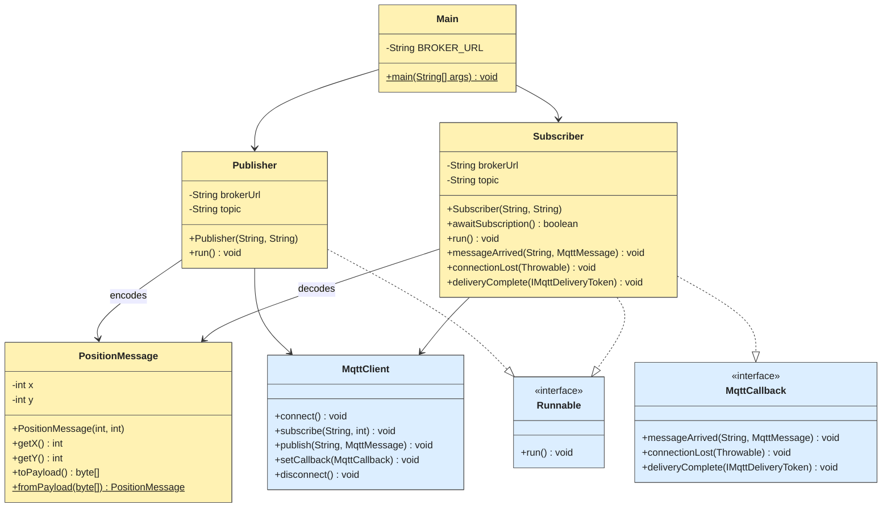

# Class diagram

```mermaid
classDiagram
    direction TB

    class Main {
        -String BROKER_URL
        +main(String[] args)$ void
    }
    class Publisher {
        -String brokerUrl
        -String topic
        +Publisher(String, String)
        +run() void
    }
    class Subscriber {
        -String brokerUrl
        -String topic
        +Subscriber(String, String)
        +awaitSubscription() boolean
        +run() void
        +messageArrived(String, MqttMessage) void
        +connectionLost(Throwable) void
        +deliveryComplete(IMqttDeliveryToken) void
    }
    class PositionMessage {
        -int x
        -int y
        +PositionMessage(int, int)
        +getX() int
        +getY() int
        +toPayload() byte[]
        +fromPayload(byte[])$ PositionMessage
    }
    class Runnable {
        <<interface>>
        +run() void
    }
    class MqttCallback {
        <<interface>>
        +messageArrived(String, MqttMessage) void
        +connectionLost(Throwable) void
        +deliveryComplete(IMqttDeliveryToken) void
    }
    class MqttClient {
        +connect() void
        +subscribe(String, int) void
        +publish(String, MqttMessage) void
        +setCallback(MqttCallback) void
        +disconnect() void
    }

    Main --> Publisher
    Main --> Subscriber
    Publisher --> PositionMessage : encodes
    Subscriber --> PositionMessage : decodes
    Publisher --> MqttClient
    Subscriber --> MqttClient
    Publisher ..|> Runnable
    Subscriber ..|> Runnable
    Subscriber ..|> MqttCallback

    style Main fill:#FFF2B3,stroke:#555555,color:#222222
    style Publisher fill:#FFF2B3,stroke:#555555,color:#222222
    style Subscriber fill:#FFF2B3,stroke:#555555,color:#222222
    style PositionMessage fill:#FFF2B3,stroke:#555555,color:#222222
    style Runnable fill:#DCEEFF,stroke:#555555,color:#222222
    style MqttCallback fill:#DCEEFF,stroke:#555555,color:#222222
    style MqttClient fill:#DCEEFF,stroke:#555555,color:#222222
```
