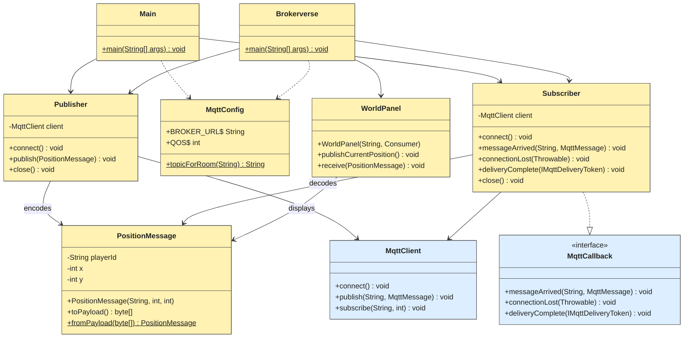

# UML class diagram

The console and Brokerverse share their message, MQTT publishing, and callback-based subscribing classes.

```mermaid
classDiagram
    direction TB
    class Main {
        +main(String[] args)$ void
    }
    class Brokerverse {
        +main(String[] args)$ void
    }
    class WorldPanel {
        +WorldPanel(String, Consumer)
        +publishCurrentPosition() void
        +receive(PositionMessage) void
    }
    class MqttConfig {
        +BROKER_URL$ String
        +QOS$ int
        +topicForRoom(String)$ String
    }
    class PositionMessage {
        -String playerId
        -int x
        -int y
        +PositionMessage(String, int, int)
        +toPayload() byte[]
        +fromPayload(byte[])$ PositionMessage
    }
    class Publisher {
        -MqttClient client
        +connect() void
        +publish(PositionMessage) void
        +close() void
    }
    class Subscriber {
        -MqttClient client
        +connect() void
        +messageArrived(String, MqttMessage) void
        +connectionLost(Throwable) void
        +deliveryComplete(IMqttDeliveryToken) void
        +close() void
    }
    class MqttCallback {
        <<interface>>
        +messageArrived(String, MqttMessage) void
        +connectionLost(Throwable) void
        +deliveryComplete(IMqttDeliveryToken) void
    }
    class MqttClient {
        +connect() void
        +publish(String, MqttMessage) void
        +subscribe(String, int) void
    }

    Main --> Publisher
    Main --> Subscriber
    Brokerverse --> Publisher
    Brokerverse --> Subscriber
    Brokerverse --> WorldPanel
    Publisher --> PositionMessage : encodes
    Subscriber --> PositionMessage : decodes
    WorldPanel --> PositionMessage : displays
    Publisher --> MqttClient
    Subscriber --> MqttClient
    Subscriber ..|> MqttCallback
    Main ..> MqttConfig
    Brokerverse ..> MqttConfig

    style Main fill:#FFF2B3,stroke:#555555,color:#222222
    style Brokerverse fill:#FFF2B3,stroke:#555555,color:#222222
    style WorldPanel fill:#FFF2B3,stroke:#555555,color:#222222
    style Publisher fill:#FFF2B3,stroke:#555555,color:#222222
    style Subscriber fill:#FFF2B3,stroke:#555555,color:#222222
    style PositionMessage fill:#FFF2B3,stroke:#555555,color:#222222
    style MqttConfig fill:#FFF2B3,stroke:#555555,color:#222222
    style MqttCallback fill:#DCEEFF,stroke:#555555,color:#222222
    style MqttClient fill:#DCEEFF,stroke:#555555,color:#222222
```
